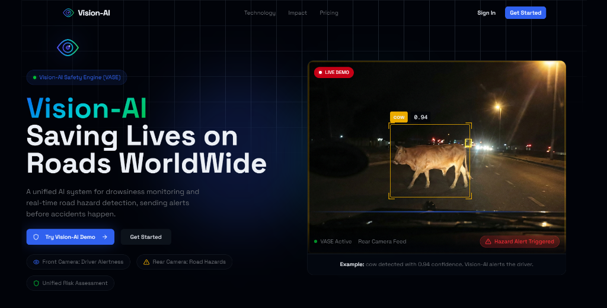
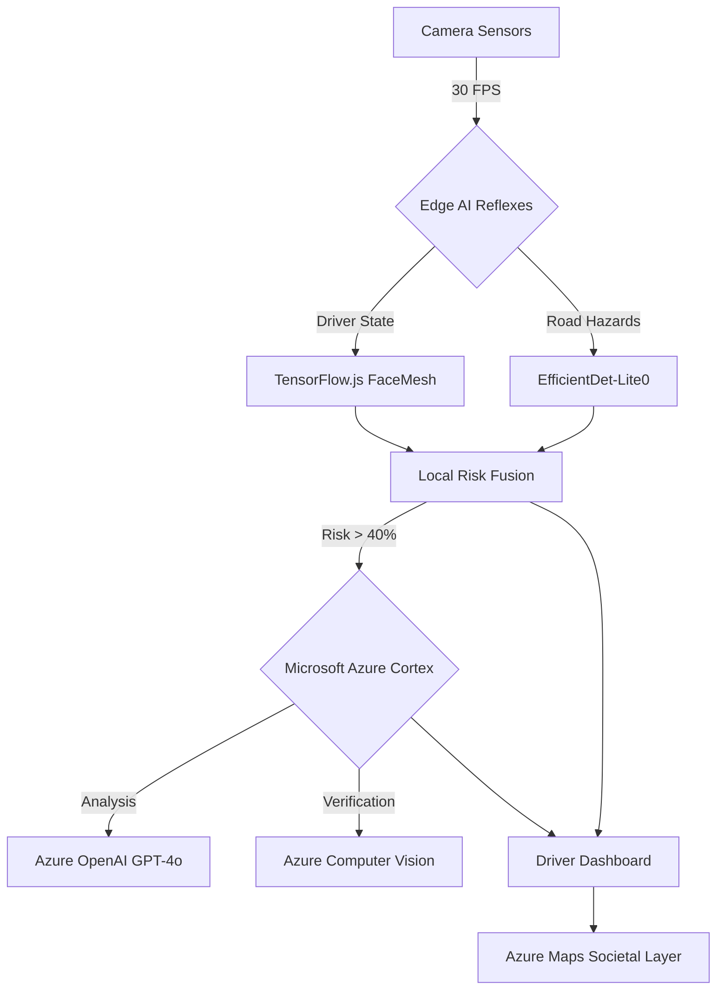

<div align="center">
  
  
  <h1>Vision-AI: The Hybrid Safety Engine</h1>
  <p><strong>Democratizing Advanced Driver Assistance Systems (ADAS) with Edge AI & Microsoft Azure.</strong></p>

  [](https://opensource.org/licenses/MIT)
  [](https://azure.microsoft.com)
  [](https://nextjs.org)
</div>

---

## 🛑 The "Why": A Silent Crisis
Every single year, **1.19 million people** lose their lives in road traffic accidents globally. That is one person every 24 seconds.

Behind these numbers are families destroyed, dreams shattered, and futures stolen. The tragedy is that **93%** of these accidents are preventable, caused by human error:
*   **Drowsiness**: The microsleep that happens when you push yourself too hard.
*   **Late Reaction**: Failing to spot a jaywalking pedestrian or a stray animal in the dark.
*   **Context Blindness**: Driving aggressively in a high-accident zone without knowing it.

**Vision-AI** is our answer. We operate with a single, unwavering intention: **To reduce accidents and save lives using the hardware you already own.**

---

## 🛠️ Technical Deep Dive: The Hybrid Architecture

Vision-AI utilizes a **Hybrid Edge-Cloud Architecture** called **VASE (Vision-AI Safety Engine)**. It mimics the human brain by splitting tasks between "Reflexes" (Edge) and "Reasoning" (Cloud).



### 1. The Reflex Engine (Client-Side AI)
We utilize **TensorFlow.js** with a **WebGL** backend to accelerate inference on the user's GPU (Zero Latency).

#### A. Internal Stream: Driver State Monitoring (FaceMesh)
*   **Model**: MediaPipe Face Landmark Detection (468 distinct keypoints).
*   **Algorithm**: We calculate the **EAR (Eye Aspect Ratio)** in real-time to detect fatigue.
    $$EAR = \frac{||p_2 - p_6|| + ||p_3 - p_5||}{2 \times ||p_1 - p_4||}$$
*   **Logic**:
    *   The vertical distance between eyelids is averaged against the horizontal eye width.
    *   If `EAR < 0.25` for `> 20 frames` (approx 0.8s), it registers as a "Microsleep".
    *   **Head Pose**: We compute the Euler angles (Pitch, Yaw, Roll) to detect distraction.

#### B. External Stream: Road Hazard Detection (EfficientDet)
*   **Model**: EfficientDet-Lite0 (Quantized Int8).
*   **Objects Detected**: `person`, `animal`, `vehicle`, `road_hazard`.
*   **Fusion**: Detections are validated against a "Risk Box" (Center 60% of frame) to prioritize immediate threats over sidewalk objects.

### 2. The Cloud Cortex (Microsoft Azure AI)
While Edge handles milliseconds, **Azure** handles context and reasoning.

#### A. Feature: Azure Safety Copilot (Azure OpenAI)
*   **Service**: **Azure OpenAI Service (GPT-4o)** via REST API.
*   **Trigger**: When `Risk Score > 40%`.
*   **Input**: `{ drowsiness: 65%, hazards: ["cow"], time: "02:14 AM", speed: "High" }`
*   **Reasoning**: The model serves as a co-pilot, analyzing the combination of factors.
*   **Output**: Natural language advice displayed in the UI (e.g., *"Fatigue detected on a dark road with animals present. High collision risk. Stop at the next lighted area."*)

#### B. Feature: The "Second Opinion" (Azure Computer Vision)
*   **Service**: **Azure AI Vision (Image Analysis 4.0)**.
*   **Problem**: Small edge models sometimes mistake a mailbox for a child generally known as "Hallucinations".
*   **Solution**: If the Edge model detects a `hazard` with low confidence (40-60%), we send a **single frame** to Azure Vision.
*   **Result**: Azure validates the object labels. If verified, the alert is upgraded to **CRITICAL**.

#### C. Feature: Societal Safety Map (Azure Maps)
*   **Service**: **Azure Maps**.
*   **Function**: As thousands of users drive, Vision-AI aggregates "Risk Events" (potholes, frequent braking zones) into a heatmap.
*   **Impact**: Visualizes high-risk infrastructure to warn other drivers before they even see the danger.

### 3. Risk Assessment Logic
The sensor data is fused into a single **Safety Score** (0-100%) every 200ms:

```typescript
Risk = (DrowsinessScore * 0.6) + (HazardSeverity * 0.4) + (AzureRiskModifier)
```

| Risk Level | Trigger Condition | Edge Action | Azure Action |
| :--- | :--- | :--- | :--- |
| **SAFE** | `Score < 30` | Monitoring (Green UI) | Idle (Save Cost) |
| **CAUTION** | `Score 30-70` | Visual Warning | GPT-4o Advice |
| **CRITICAL** | `Score > 70` | **Loud Alarm** + Startle Tone | Vision Validation + Emergency Email |

---

## ⚡ Tech Stack

### Cloud Infrastructure (Microsoft Azure)
*   **Azure OpenAI**: Intelligence & Reasoning.
*   **Azure Computer Vision**: Foundation Model Validation.
*   **Azure Maps**: Geospatial Visualization.

### Frontend & Application
*   **Next.js 16 (App Router)**: The backbone, utilizing Server Actions for secure API handling.
*   **React 19**: Leveraging the latest concurrent features for smooth UI updates.
*   **Tailwind CSS 4**: Zero-runtime styling for the "Futuristic Dashboard" aesthetic.
*   **Shadcn UI**: Accessible, robust component primitives.
*   **Framer Motion**: Smooth GPU-accelerated animations for alerts.

### Backend & Infrastructure
*   **Supabase (PostgreSQL)**: Stores session telemetry, user profiles, and alert history.
*   **Row Level Security (RLS)**: Ensures users only access their own driving data.
*   **Nodemailer (SMTP)**: Handles critical "Life Saving" email dispatch logic.
*   **Stripe**: Manages subscription tiers (Pro/Enterprise) for cloud storage.


### Artificial Intelligence
*   **@tensorflow/tfjs**: The core tensor operations engine.
*   **@mediapipe/tasks-vision**: Optimized WASM binaries for computer vision tasks.
*   **WebGL**: Utilizing the GPU for non-blocking main thread performance.
---

## 🚀 Getting Started

Turn your laptop into a safety device in 5 minutes.

### Prerequisites
*   Node.js 18.17+
*   Webcam (Internal) + Phone (Optional for Rear)
*   Azure Cloud Subscription

### Installation

1.  **Clone the Repository**
    ```bash
    git clone https://github.com/Devansh-Sahu/Vision-AI.git
    cd Vision-AI
    ```

2.  **Install Dependencies**
    ```bash
    npm install
    ```

3.  **Environment Setup**
    Create a `.env.local` file with your credentials:
    ```env
    # App & Database
    NEXT_PUBLIC_SUPABASE_URL=...
    NEXT_PUBLIC_SUPABASE_ANON_KEY=...
    
    # Microsoft Azure (Mandatory for Cloud Features)
    AZURE_OPENAI_ENDPOINT=https://your-resource.openai.azure.com/
    AZURE_OPENAI_KEY=...
    AZURE_VISION_ENDPOINT=https://your-resource.cognitiveservices.azure.com/
    AZURE_VISION_KEY=...
    
    # Alerts
    SMTP_USER=...
    SMTP_PASS=... 
    ```

4.  **Run Development Server**
    ```bash
    npm run dev
    ```
    Visit `http://localhost:3000` to start VASE.

---

## 🛡️ License
Distributed under the MIT License. See `LICENSE` for more information.

---

<div align="center">
  <p><em>Built with Hope, Code, and the intent to Save Lives.</em></p>
  <p><strong> Vision-AI </strong></p>
</div>

